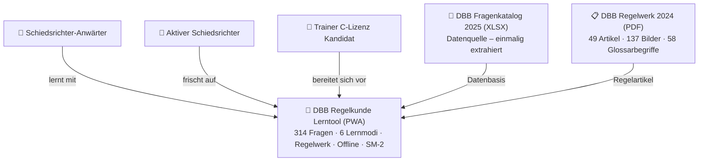
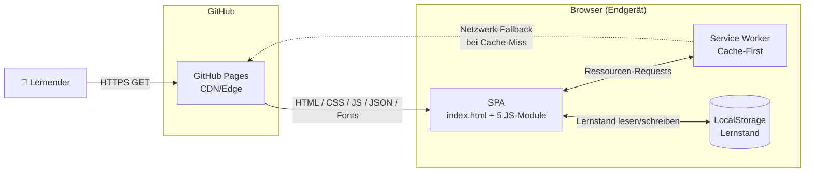
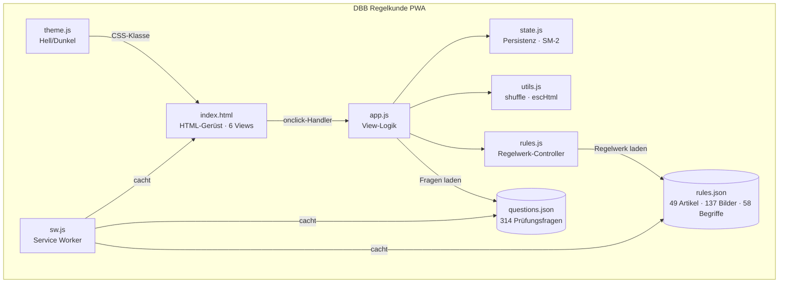
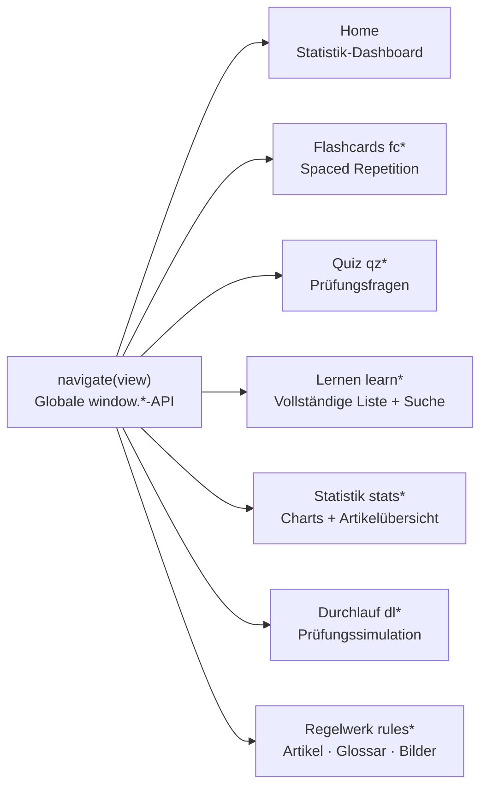
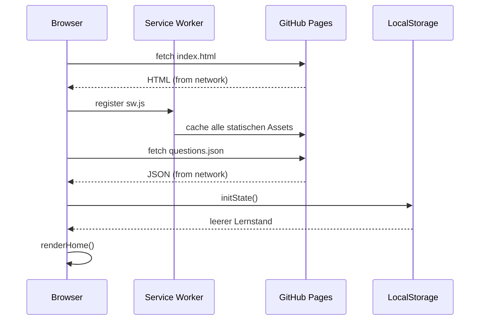
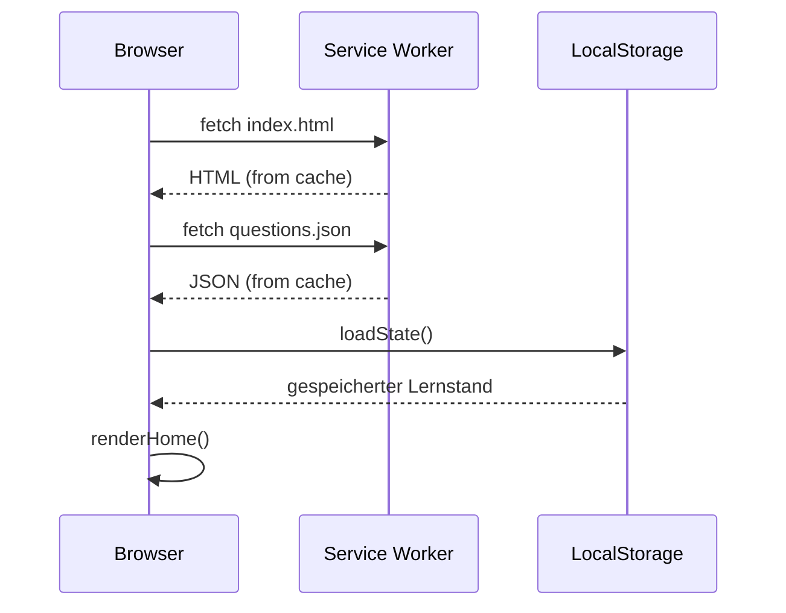
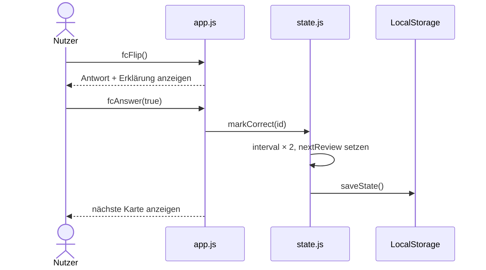
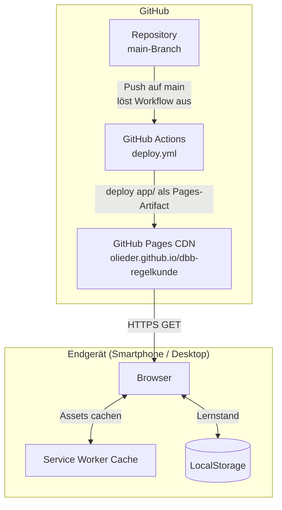
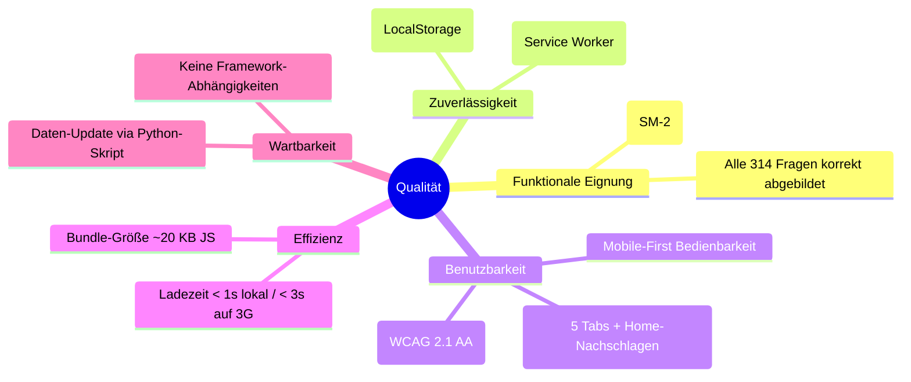

# ARC42 Architekturdokumentation: DBB Regelkunde Lerntool

**Version:** 1.1
**Datum:** 2026-03-18
**Status:** Living Document

---

## 1. Einführung und Ziele

### 1.1 Aufgabenstellung

Das DBB Regelkunde Lerntool ist eine Progressive Web App (PWA) zur Prüfungsvorbereitung für DBB-Schiedsrichter. Die Anwendung stellt die 314 offiziellen Prüfungsfragen aus dem DBB Schiedsrichter-Fragenkatalog 2025 in verschiedenen Lernmodi zur Verfügung.

**Kernaufgabe:** Offline-fähige, mobile-first Lernanwendung für die Schiedsrichterausbildung im deutschen Basketball.

### 1.2 Qualitätsziele

| Priorität | Qualitätsziel | Szenario |
|-----------|---------------|----------|
| 1 | **Offline-Verfügbarkeit** | Lernende können ohne Internetverbindung alle Fragen bearbeiten |
| 2 | **Zugänglichkeit** | Einhaltung WCAG 2.1 AA – die App ist mit Screenreader und Tastatur vollständig bedienbar |
| 3 | **Mobile-First** | Nahtlose Bedienung auf dem Smartphone (getestet auf Pixel 7, 412×915px) |
| 4 | **Persistenz** | Lernfortschritt bleibt gerätelokal dauerhaft erhalten (LocalStorage) |
| 5 | **Einfache Wartbarkeit** | Jährliche Datenbasis-Aktualisierung ohne Code-Änderungen (Python-Extraktor) |

### 1.3 Stakeholder

| Rolle | Erwartung |
|-------|-----------|
| **Schiedsrichter-Anwärter** | Effektives Lernen für die Prüfung, mobil und offline nutzbar |
| **Aktive Schiedsrichter** | Auffrischung und Überprüfung des Regelwissens |
| **Trainer C-Lizenz Kandidaten** | Gezieltes Lernen prüfungsrelevanter Regelartikel |
| **DBB / Schiedsrichterwesen** | Aktuelle und korrekte Wissensvermittlung |

---

## 2. Randbedingungen

### 2.1 Technische Randbedingungen

| Randbedingung | Hintergrund |
|---------------|-------------|
| Kein Backend | Nur statisches Hosting (GitHub Pages), keine Serverinfrastruktur |
| Kein Build-Prozess | Direktes Ausliefern von HTML/CSS/JS – keine Transpilierung, kein Bundler |
| Keine externen Abhängigkeiten | Alle Assets (Fonts, Icons, Daten) sind lokal eingebettet |
| Vanilla JavaScript | ES6-Module, kein Framework (React, Vue etc.) |
| Datenbasis als JSON | Fragen werden einmalig aus XLSX extrahiert und als statische Datei bereitgestellt |

### 2.2 Organisatorische Randbedingungen

| Randbedingung | Hintergrund |
|---------------|-------------|
| Datenbasis DBB 2025 | Offizielle Prüfungsfragen des DBB Schiedsrichter-Fragenkatalogs 2025 |
| Jährlicher Update-Zyklus | Fragenkatalog wird vom DBB jährlich aktualisiert |
| Open Source / öffentlich | Repository und Deployment auf GitHub / GitHub Pages |

---

## 3. Kontextabgrenzung

### 3.1 Fachlicher Kontext



### 3.2 Technischer Kontext



**Externe Schnittstellen:** keine (vollständig selbstenthalten)

---

## 4. Lösungsstrategie

| Entscheidung | Begründung |
|--------------|------------|
| **Statische PWA** | Kein Backend nötig → maximale Einfachheit, kostenfreies Hosting, offline-fähig |
| **Vanilla JS (ES6-Module)** | Keine Build-Komplexität, direkt lauffähig, langfristig wartbar |
| **LocalStorage für Persistenz** | Kein Account/Login nötig, vollständig clientseitig, DSGVO-unbedenklich |
| **Spaced Repetition (SM-2)** | Wissenschaftlich belegte Lernmethode für Langzeitretention |
| **Cache-First Service Worker** | Offline-Nutzung als primäres Qualitätsziel (Smartphone-Nutzung unterwegs) |
| **Daten-Pipeline (Python)** | Trennung von Datenpflege und Anwendungslogik, wiederholbarer Prozess |
| **GitHub Actions CI/CD** | Automatisches Deployment bei jedem Push auf `main` |

---

## 5. Bausteinsicht

### 5.1 Ebene 1 – Gesamtsystem



### 5.2 Ebene 2 – app.js (View-Controller)

`app.js` implementiert alle Anwendungsviews als eigenständige „Mini-Controller":



| Controller | Beschreibung |
|------------|-------------|
| **Home** | Startseite mit Gesamtstatistik-Kacheln |
| **Flashcards (`fc*`)** | Lernkarten mit SM-2 Spaced Repetition |
| **Quiz (`qz*`)** | Zufällige Prüfungsfragen mit Sofort-Feedback |
| **Lernen (`learn*`)** | Vollständige Fragenliste mit Suche und Filterung |
| **Statistik (`stats*`)** | Donut-Charts und artikelbezogene Fortschrittsanzeige |
| **Durchlauf (`dl*`)** | Prüfungssimulation (2× hintereinander richtig pro Frage) |
| **Regelwerk (`rules*`)** | Volltext-Regelartikel mit Glossar-Annotations, Bilder-Galerie und Suchfunktion |

### 5.3 Ebene 2 – state.js (Datenhaltung)

```javascript
// LocalStorage-Schlüssel
const STORAGE_KEY = 'regelkunde_v2';

// Datenstruktur je Frage
{
  correctCount: number,   // Gesamtzahl richtiger Antworten
  wrongCount: number,     // Gesamtzahl falscher Antworten
  interval: number,       // Tage bis zur nächsten Wiederholung
  nextReview: timestamp,  // Unix-Zeitstempel der nächsten Fälligkeit
  streak: number          // Aktuelle Korrekt-Streak
}
```

**SM-2 Intervall-Wachstum:**
`1 → 2 → 4 → 8 → 16 → 30 Tage` (bei falscher Antwort: Reset auf 1 Tag)

**Mastery-Bedingung:** `correctCount >= 3 AND (correctCount - wrongCount) >= 3`

---

## 6. Laufzeitsicht

### 6.1 Erster App-Start



### 6.2 Wiederkehrender Nutzer (offline)



### 6.3 Lernkarte beantworten (Flashcard-Modus)



---

## 7. Verteilungssicht



**Deployment-Prozess:**
1. Push auf `main`-Branch
2. GitHub Actions Workflow `deploy.yml` startet automatisch
3. `actions/upload-pages-artifact` packt den `app/`-Ordner
4. `actions/deploy-pages` veröffentlicht auf GitHub Pages

---

## 8. Querschnittliche Konzepte

### 8.1 Datenpersistenz

Alle Nutzerdaten werden ausschließlich clientseitig in `localStorage` gespeichert unter dem Schlüssel `regelkunde_v2`.

**Kein Cloud-Sync** – der Lernstand ist gerätegebunden. Das ist eine bewusste Entscheidung für maximale Einfachheit und DSGVO-Konformität.

### 8.2 Offline-Strategie (Cache-First)

Der Service Worker (`sw.js`) cacht beim ersten Besuch alle statischen Assets. Alle nachfolgenden Requests werden zuerst aus dem Cache beantwortet. Nur bei einem Cache-Miss wird das Netzwerk angefragt.

Gecachte Dateien:
- `index.html`
- `css/style.css`
- `js/app.js`, `state.js`, `theme.js`, `utils.js`, `rules.js`
- `data/questions.json`
- `data/rules.json`
- `manifest.json`
- Fonts und Icons

### 8.3 Spaced-Repetition-Algorithmus (SM-2-Variante)

```
Intervall-Wachstum: 1 → 2 → 4 → 8 → 16 → 30 Tage
Bei falscher Antwort: Reset auf 1 Tag (Frage nach 5 Min. wieder fällig)
Mastery: correctCount ≥ 3 UND (correctCount - wrongCount) ≥ 3
```

Die Warteschlange wird bei jedem Modus-Start neu gebaut:
1. Fällige Karten (zufällig gemischt)
2. Noch nicht fällige Karten (nach Fälligkeitsdatum sortiert)

### 8.4 Kategorien und Filterung

| Kategorie | Anzahl | Beschreibung |
|-----------|--------|-------------|
| Regelfragen | 175 | Offizielle Regelauslegungsfragen |
| KR-Fragen | 139 | Kooperationsregeln-Fragen |
| Trainer C-Lizenz | ~50–70 | Subset der Regelfragen (6 Themenbereiche) |

**Trainer C-Lizenz Themenbereiche:** Mannschaft (Art. 4,5,7), Spielzeit (Art. 8,9), Ball (Art. 10,12,13), Bewegung (Art. 14–16), Zeitregeln (Art. 25–35), Fouls (Art. 36–42)

### 8.5 Barrierefreiheit (WCAG 2.1 AA)

- Semantisches HTML5 (`role="application"`, `role="progressbar"`, etc.)
- ARIA-Labels an allen interaktiven Elementen
- `aria-live="polite"` für dynamische Inhalte
- `lang="de"` am HTML-Element
- Tastaturnavigation vollständig (Space, J/N, Pfeiltasten)
- Touch-Gesten (Swipe links/rechts)
- Klasse `.sr-only` für screenreader-only Text

#### Keyboard-Trap-Prävention in modalen Overlays (seit v1.1)

Modale Overlays (Lightbox, Artikel-Detail, Glossar-Popup) implementieren vollständiges Fokus-Management:

| Overlay | Öffnen | Schließen | Escape | Focus-Trap | Fokus-Rückgabe |
|---------|--------|-----------|--------|------------|----------------|
| **Lightbox** | Fokus → Schließen-Button | `✕`-Button oder Klick auf Backdrop | ✓ | Tab bleibt auf Schließen-Button | ✓ → auslösendes Element |
| **Artikel-Detail** | Fokus → Zurück-Button | Zurück-Button | ✓ | Tab zirkuliert durch alle fokussierbaren Elemente im Overlay | ✓ → angeklickte Artikel-Card |
| **Glossar-Popup** | Fokus → Schließen-Button | `✕`-Button | ✓ | Tab zirkuliert innerhalb der Popup-Buttons | ✓ → angeklickter Glossar-Begriff |

**Hintergrund:** Ohne dieses Fokus-Management konnten Tastaturnutzer nach dem Öffnen eines Overlays nicht mehr zur Hauptnavigation zurücknavigieren (Keyboard-Trap). Besonders betroffen waren die Bilder-Galerie (Lightbox) und die Regelwerk-Artikelansicht.

**Suchfeld-Trap (Regelwerk & Lernen):** `<input type="search">` rendert in Safari/Chrome einen nativen Clear-Button, der in den Tab-Fokus einfließt und den Tab-Fluss aus dem Eingabefeld heraus blockiert. Dieser Button wird per CSS ausgeblendet:
```css
.rules-search-input::-webkit-search-cancel-button,
.search-input::-webkit-search-cancel-button { display: none; }
```

**Globaler Escape-Handler:** `app.js` fängt `Escape` dokumentweit ab und schließt das jeweils oberste aktive Overlay — unabhängig davon, wo der Fokus gerade liegt.

### 8.6 Theming

Hell/Dunkel-Modus via CSS Custom Properties. Präferenz wird in `localStorage` gespeichert, `prefers-color-scheme` wird als Fallback ausgelesen.

```css
:root {
  --bg: #0d0f14;      /* Dunkel-Standard */
  --text: #e8eaf0;
}
[data-theme="light"] {
  --bg: #f5f6fa;
  --text: #1a1b1e;
}
```

### 8.7 XSS-Schutz

Alle dynamisch in den DOM eingefügten Inhalte werden über `escHtml()` sanitiert:
```javascript
function escHtml(str) {
  return String(str)
    .replace(/&/g, '&amp;')
    .replace(/</g, '&lt;')
    .replace(/>/g, '&gt;')
    .replace(/"/g, '&quot;');
}
```

`rules.js` verwendet durchgängig die sichere DOM-API (kein `innerHTML`). Die Glossar-Annotation (`annotateTextWithGlossary`) baut Textknoten und Buttons ausschließlich via `document.createElement` / `textContent` auf – Regelartikel-Text wird niemals als HTML interpretiert.

---

## 9. Architekturentscheidungen

### ADR-001: Vanilla JavaScript statt Framework

**Status:** Akzeptiert
**Kontext:** Lernwerkzeug mit überschaubarer Komplexität, kein Build-System erwünscht
**Entscheidung:** Kein React/Vue/Angular – ES6-Module direkt im Browser
**Konsequenzen:** Geringe Bundle-Größe (~20 KB JS), kein npm-Build nötig, langfristig wartbar ohne Framework-Versionsprobleme. Dafür kein automatisches DOM-Diffing, manuelle View-Verwaltung nötig.

### ADR-002: LocalStorage statt Cloud-Persistenz

**Status:** Akzeptiert
**Kontext:** Kein Backend vorhanden, DSGVO-Sensibilität, Einfachheit
**Entscheidung:** Lernstand ausschließlich in `localStorage` (gerätelokal)
**Konsequenzen:** Keine Registrierung/Login nötig, vollständig DSGVO-konform. Dafür kein geräteübergreifendes Synchronisieren des Lernstands.

### ADR-003: Cache-First Service Worker

**Status:** Akzeptiert
**Kontext:** Mobile Nutzung in schlechter Netzabdeckung (Sporthallen, unterwegs)
**Entscheidung:** Service Worker cacht alle Assets, Offline-Nutzung als First-Class Feature
**Konsequenzen:** App vollständig offline nutzbar nach erstem Besuch. Bei Updates muss der Service-Worker-Cache manuell versioniert werden (`CACHE_VERSION`).

### ADR-004: Statisches Hosting auf GitHub Pages

**Status:** Akzeptiert
**Kontext:** Kein Backend, kein eigener Server, kostenfreie Bereitstellung
**Entscheidung:** GitHub Pages + GitHub Actions für automatisches Deployment
**Konsequenzen:** Kostenfrei, automatisch deployt, öffentlich zugänglich. Keine serverseitige Logik möglich.

### ADR-005: Python-Skript zur Datenextraktion

**Status:** Akzeptiert
**Kontext:** Offizielle Fragendaten liegen als XLSX vor, müssen als JSON eingebettet werden
**Entscheidung:** `extract_questions.py` liest XLSX als ZIP, parst XML, erzeugt `questions.json`
**Konsequenzen:** Klare Datenpipeline, Trennung von Datenpflege und App-Logik. Jährliche Aktualisierung ohne Code-Änderungen möglich.

### ADR-006: Regelwerk als separates ES-Modul (rules.js)

**Status:** Akzeptiert
**Kontext:** Das vollständige Regelwerk (49 Artikel, 137 Bilder, 58 Glossarbegriffe) wurde als Feature hinzugefügt, was zu erheblichem Code-Umfang führt
**Entscheidung:** Regelwerk-Logik in eigenem ES-Modul `rules.js` kapseln, das lazy von `app.js` importiert wird
**Konsequenzen:** `app.js` bleibt überschaubar; `rules.js` kann unabhängig weiterentwickelt werden. Glossar-Annotations nutzen ausschließlich sichere DOM-API (kein innerHTML).

### ADR-007: Navigation-Konsolidierung (5 statt 7 Bottom-Nav-Buttons)

**Status:** Akzeptiert
**Kontext:** Bottom Navigation hatte 7 Einträge – zu viele für ein mobiles Interface
**Entscheidung:** Bottom Nav auf 5 primäre Aktionen reduziert (Home, Karten, Quiz, Lernen, Durchlauf). Regelwerk und Statistik über Home-Sektion „Nachschlagen" erreichbar
**Konsequenzen:** Saubereres mobiles UI. Regelwerk und Statistik sind einen Tap weiter entfernt, aber besser gruppiert.

---

## 10. Qualitätsszenarien

### 10.1 Qualitätsbaum



### 10.2 Bewertungsszenarien

| # | Szenario | Reaktion | Bewertung |
|---|----------|---------|-----------|
| Q1 | Nutzer öffnet App ohne Internetverbindung (nach erstem Besuch) | App lädt vollständig aus Service Worker Cache | Erfüllt |
| Q2 | Nutzer beantwortet 314 Fragen; App soll Lernstand nicht verlieren | LocalStorage persistiert alle Karten-Zustände dauerhaft | Erfüllt |
| Q3 | Screenreader-Nutzer navigiert durch Flashcard-Modus | Alle interaktiven Elemente haben ARIA-Labels, Live-Regions für Statusmeldungen | Erfüllt |
| Q6 | Tastaturnutzer öffnet Bild-Lightbox und möchte sie wieder schließen | Fokus springt auf Schließen-Button, Escape schließt, Fokus kehrt zum auslösenden Element zurück | Erfüllt |
| Q7 | Tastaturnutzer öffnet Artikel-Detail und navigiert zurück | Fokus springt auf Zurück-Button, Focus-Trap hält Tab im Overlay, Escape und Zurück-Button geben Fokus an Artikel-Card zurück | Erfüllt |
| Q4 | Jährliche Aktualisierung der Fragendatenbank | Python-Skript auf neue XLSX ausführen → `questions.json` ersetzen → deployen | Erfüllt |
| Q5 | Nutzer wechselt zwischen Smartphone und Tablet | Responsives Layout, viewport-meta korrekt gesetzt | Erfüllt |

---

## 11. Risiken und technische Schulden

| Risiko | Wahrscheinlichkeit | Auswirkung | Maßnahme |
|--------|-------------------|------------|---------|
| LocalStorage-Quota überschritten (5–10 MB) | Gering | Lernstand-Verlust | Warnung bei Speicherfehler, alternativ IndexedDB |
| Service Worker cacht veraltete Frageversion | Mittel | Falsche Fragen nach Update | `CACHE_VERSION` bei jedem Daten-Update inkrementieren |
| Kein geräteübergreifender Sync | Hoch (konzeptionell) | Lernstand nicht auf zweitem Gerät verfügbar | Bewusst akzeptiert (kein Backend) |
| XLSX-Format ändert sich | Mittel | Python-Skript muss angepasst werden | Extraktion jährlich manuell prüfen |
| Keine Analytics | Hoch | Nutzungsmuster unbekannt | Privacy-friendly Analytics (z.B. Plausible) möglich |
| Glossar-Regex zu aggressiv (Teilwort-Matches) | Mittel | Falsche Hervorhebungen im Text | Längste Terme zuerst matchen, ggf. Wortgrenzen ergänzen |

---

## 12. Glossar

| Begriff | Erklärung |
|---------|-----------|
| **DBB** | Deutscher Basketball Bund |
| **SM-2** | SuperMemo 2 – Spaced-Repetition-Algorithmus für optimale Wiederholungsintervalle |
| **PWA** | Progressive Web App – Web-App mit nativen App-Fähigkeiten (Offline, Installierbar) |
| **Service Worker** | Browser-Background-Script für Caching und Offline-Fähigkeit |
| **LocalStorage** | Browser-API für persistente Key-Value-Speicherung (clientseitig) |
| **Regelfragen** | 175 offizielle Regelauslegungsfragen aus DBB-Fragenkatalog |
| **KR-Fragen** | 139 Kooperationsregeln-Fragen aus DBB-Fragenkatalog |
| **Trainer C-Lizenz** | Spezifischer Prüfungsfilter für die Trainer-C-Lizenz-Ausbildung |
| **Mastery** | Zustand einer Lernkarte: ≥ 3 richtige Antworten mit netto ≥ 3 richtig |
| **Durchlauf** | Prüfungssimulation: alle Fragen müssen 2× hintereinander richtig beantwortet werden |
| **Cache-First** | Service-Worker-Strategie: Cache bevorzugt, Netzwerk nur bei Cache-Miss |
| **WCAG 2.1 AA** | Web Content Accessibility Guidelines – Barrierefreiheitsstandard Level AA |
| **Regelwerk-View** | Neue App-Ansicht mit Volltext der 49 Regelartikel, Bildersuche und Glossar |
| **Glossar-Annotation** | Automatische Hervorhebung von Glossarbegriffen im Artikeltext mit Popup-Definition |
| **extract_rules.py** | Python-Skript (PyMuPDF) zur Extraktion von Artikeln und Bildern aus dem DBB Regelwerk PDF |
